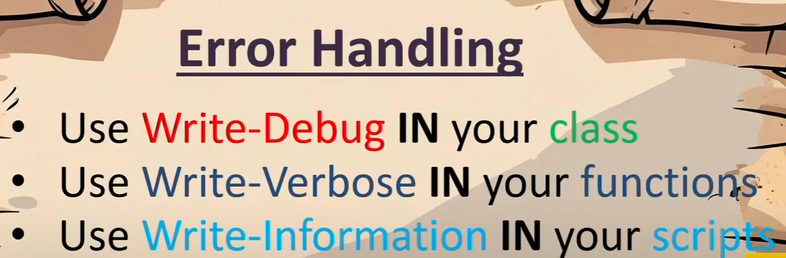

[Video Link](https://www.youtube.com/watch?v=6jQqf-LTRGI&ab_channel=PowerShellConferenceEU) 
[Github Repo](https://github.com/PalmEmanuel/YourFirstPSModuleInCSharp)

[Create UML from PowerShell](https://www.powershellgallery.com/packages/PSClassUtils/2.1.2/Content/Functions%5CPublic%5CWrite-CUClassDiagram.ps1)
[PSConferenceEU 2025 Slides and examples](https://github.com/psconfeu/2025)

# PowerShell C# Development
This repository contains resources and examples for developing PowerShell modules and scripts using C#. It includes a variety of topics such as creating PowerShell modules, using C# for PowerShell development, and understanding the output layout in .NET 8 and later.

## Futher reading:
* ### [Developing PowerShell DLL in DotNet](./Documents/Developing%20PowerShell%20DLL%20in%20DotNet.md)
* ### [Artifacts output layout in .NET 8 and later](./Documents/Artifacts%20output%20layout.md)
[Video Link](https://www.youtube.com/watch?v=6jQqf-LTRGI&ab_channel=PowerShellConferenceEU) 
[Github Repo](https://github.com/PalmEmanuel/YourFirstPSModuleInCSharp)

[Create UML from PowerShell](https://www.powershellgallery.com/packages/PSClassUtils/2.1.2/Content/Functions%5CPublic%5CWrite-CUClassDiagram.ps1)
[PSConferenceEU 2025 Slides and examples](https://github.com/psconfeu/2025)
